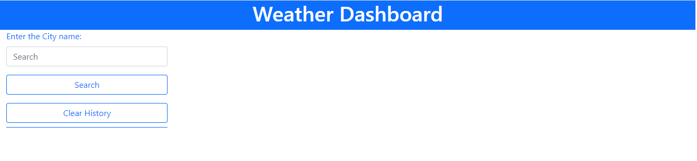

# Weather Dashboard

### This weather dashbord application was created by HTML and Javascript, there's no local CSS file as the style was purely by Bootstrap. 

### Third party API (jQuery, popper, bootstrap and moment) were used, and Server-side API were also utilised to call the results.

---

### This weather dashboard demostrate below functionalities:

1. Users can search by the name of the city,
2. Once hit the "Search" button, it will return the result to show the current date, temperature, wind speed, humidity, UV index, and the 5-day forecast,
3. If a wrong value was entered, no results will display,
4. The search results are saved automatically in the local storage,
5. Users can choose to clear the historical search by clicking the "Clear History" button.

---

### This project has been deployed to GitHub Pages and the link is as below

## [Weather Dashboard URL](https://kittenknight06.github.io/weather-dashboard/)

### - The cover page is shown as below

---

### - When enter the name of the city and hit the "Search" button, the weather information will appear, and the search history will appear under the "Clear History" button.

### - When click the "Clear history", all searched history will be cleared.

